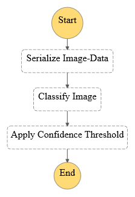
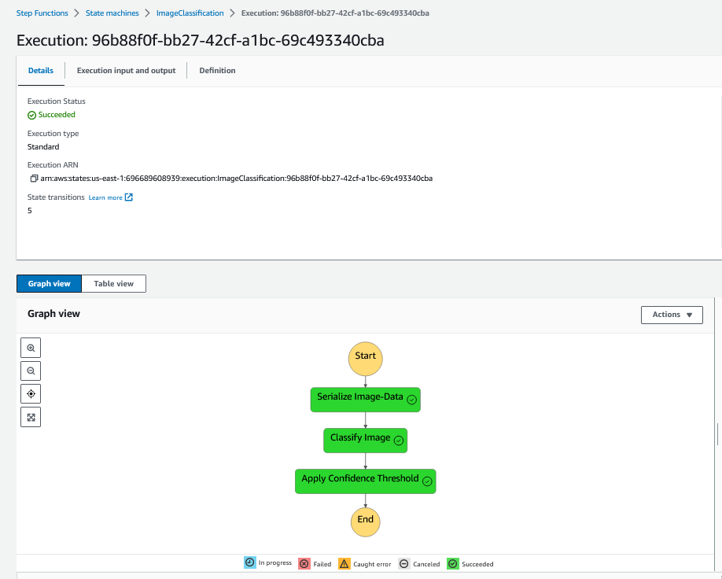
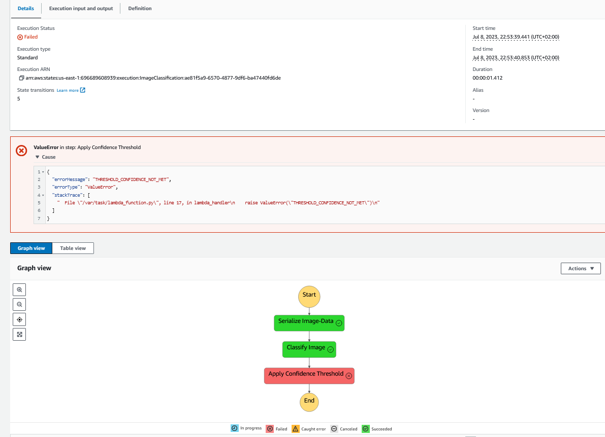
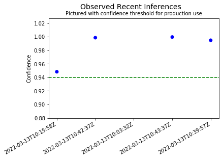
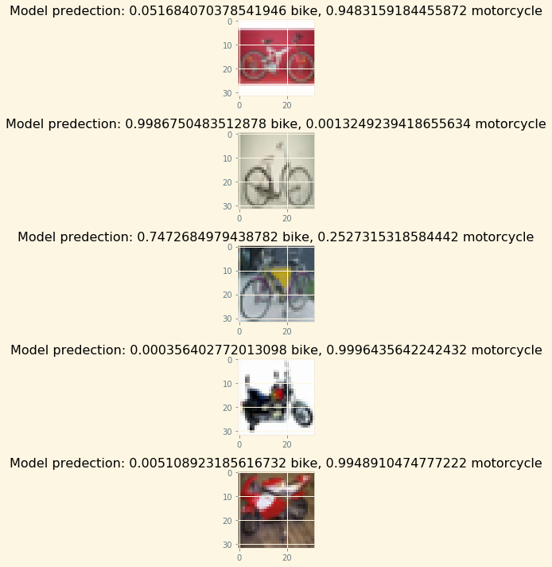

# Deploy and monitor a machine learning workflow for Image Classification

This project was part of my Machine Learning Nanodegree at Udacity. 
I used the AWS SageMaker to train and deploy the model 
together with event-driven inference workflow orchestrated via Step Function  
consisting of three lambda functions.   

**Step Function Workflow**

**Inference passing the threshold**

**Inference not passing the threshold**

 
The model itself is trained on the CIFAR dataaset hosted by the University of Toronto 
to classify images of bikes and motorcycles

 
The SageMaker Model Monitor is used to observe the Endpoint 
so we can visualize and evaluate the inferences.  

**Model Confidence for recent Inferences**

**Visual Inspection of recent Inferences**

